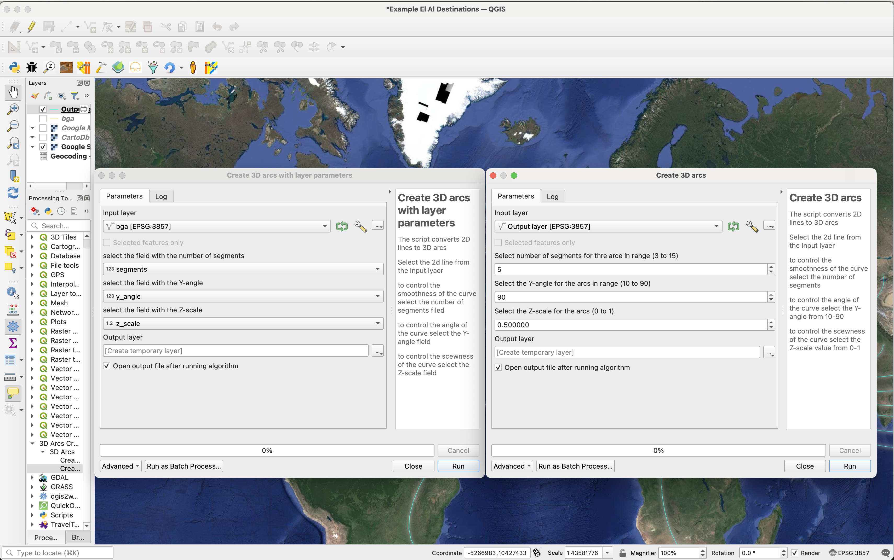

# QGIS 3D Arcs

Tool to convert 2D lines to 3D Arcs

## Plugin Description:

This tool transforms 2D lines into 3D arcs, similar to Deck.gl’s 3D arc layer or kepler.gl 3D arcs. The 3D data is embedded directly in the feature’s geometry, allowing users to visualize the arcs in QGIS 3D.
Additionally, the 3D arcs can be exported as GeoJSON for use in other platforms that support 3D coordinates, such as Arcgis online.

The layer that the plugin return is a LineStringZ type layer.

## Screenshot:

El Al (airlines) past and present destinations (2D)

El Al (airlines) past and present destinations (3D)

Arcs from Israel to Europe

Plugin Usage
